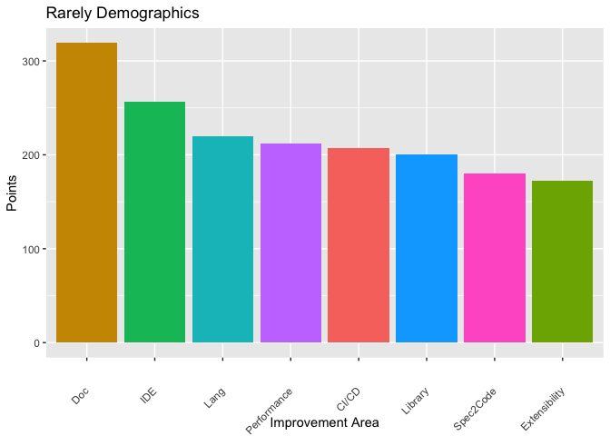
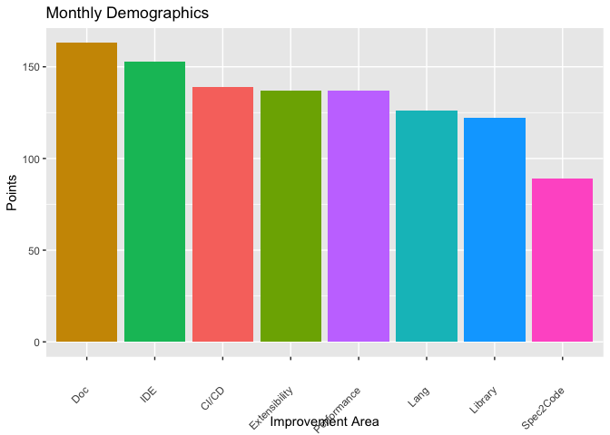
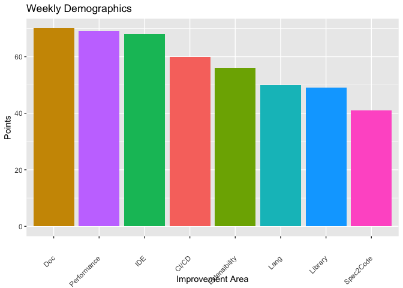

TLA+ Surveys
================
(2022-05-15)

[2022
survey](https://docs.google.com/forms/d/1GQnqZgfJKTZgZd-TydtdqT8axvRrTdWH7M87VUt0_Wk/edit?usp=sharing)

<!-- --><!-- --><!-- --><!-- --><!-- --><!-- --><!-- --><!-- -->

#### README.md is generated from README.Rmd on a host with all libraries installed via:

``` shell
Rscript -e "rmarkdown::render('README.Rmd')"
```

### Install required libraries and R packages (on macOS) with:

``` shell
brew install pandoc r
Rscript -e "install.packages(c('rmarkdown', 'ggplot2','dplyr', 'here'), repos='http://cran.us.r-project.org')"
```
